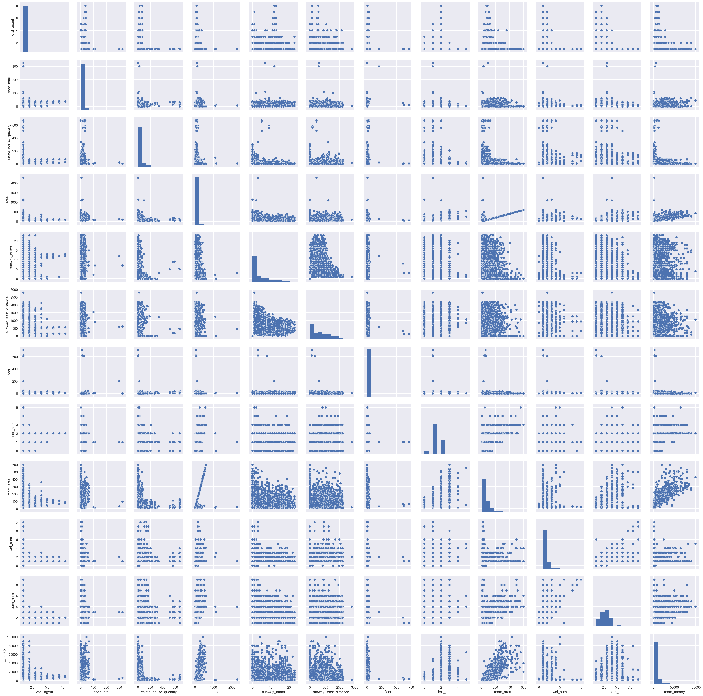
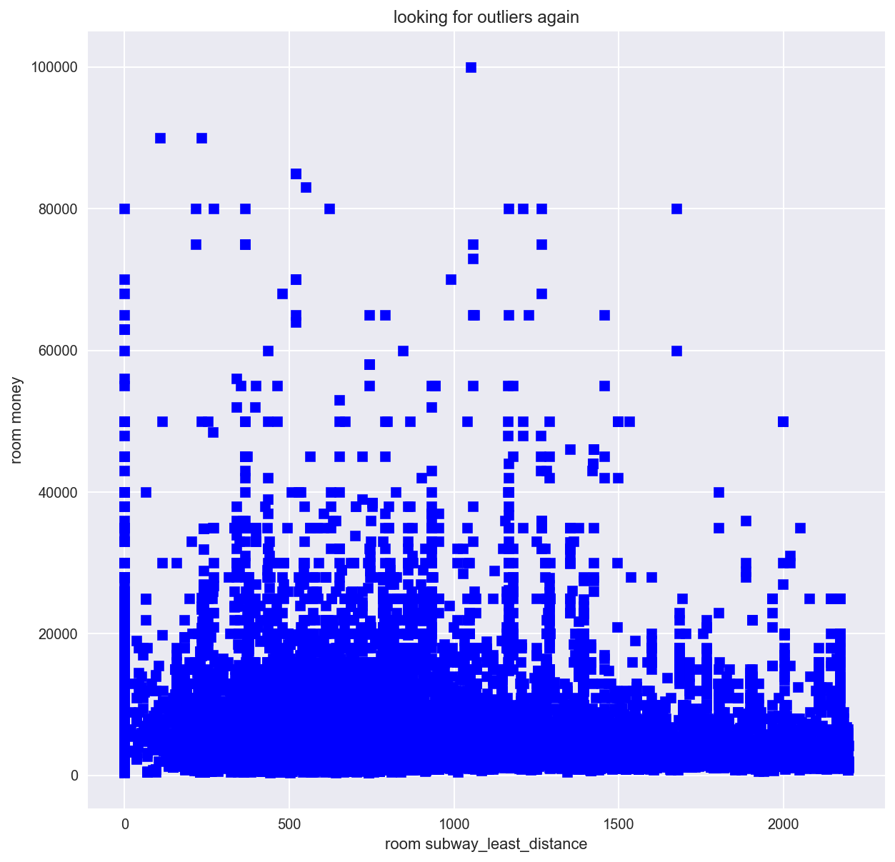

```python
# 导入组件包
import pandas as pd
import numpy as np
from sklearn.model_selection import cross_val_score, train_test_split
from sklearn.preprocessing import StandardScaler
from sklearn.linear_model import LinearRegression, RidgeCV, LassoCV, ElasticNetCV
from sklearn.metrics import mean_squared_error, make_scorer
from scipy.stats import skew
from IPython.display import display
import matplotlib.pyplot as plt
import seaborn as sns

# retina screen
%config InlineBackend.figure_format = 'retina' #set 'png' here when working on notebook
%matplotlib inline
```


```python
# 读取上海出租房数据（包括训练数据和测试数据）
all_data = pd.read_csv("./csv/shanghai_all_data.csv")
# 检查数据列详情
all_data.columns
```


    Index([u'index_id', u'room_longitude', u'room_latitude', u'total_agent',
           u'floor_total', u'owner_gender', u'room_name', u'scope_name',
           u'estate_house_quantity', u'room_money', u'rf_kt', u'rf_src', u'rf_yg',
           u'rf_bx', u'rf_wsj', u'rf_cf', u'rf_rsq', u'rf_kd', u'rf_yt', u'rf_drc',
           u'rf_xzt', u'rf_pc', u'rf_xyj', u'rf_sf', u'rf_szt', u'rf_dsj',
           u'rf_unknow', u'zhuanzu', u'keduanzu', u'estate_name', u'puf_no',
           u'puf_bx', u'puf_xyj', u'puf_kd', u'puf_rsq', u'puf_cf', u'puf_wsj',
           u'puf_kt', u'puf_sf', u'puf_nq', u'puf_wbl', u'puf_kx', u'puf_dsj',
           u'agent_money', u'commission_price', u'area', u'fdxh_zxgl', u'fdxh_agj',
           u'fdxh_bxy', u'fdxh_bhj', u'fdxh_ds', u'fdxh_yh', u'fdxh_drz',
           u'fdxh_srz', u'fdxh_nvsheng', u'fdxh_nansheng', u'region_name',
           u'rent_type', u'only_girl', u'brand_type', u'subway_nums',
           u'subway_least_distance', u'decoration', u'floor', u'room_direction',
           u'hall_num', u'room_area', u'wei_num', u'business_type', u'is_zhongjie',
           u'room_num', u'pay_method', u'room_type'],
          dtype='object')


```python
#  去除ID
all_data.drop("index_id", axis = 1, inplace = True)
# 去除中介费、提成，因为这两项一般由出租房价格决定，不是自变量
all_data.drop("agent_money", axis = 1, inplace = True)
all_data.drop("commission_price", axis = 1, inplace = True)
# 去除含义不清的rf_unknow，puf_no
all_data.drop("rf_unknow", axis = 1, inplace = True)
all_data.drop("puf_no", axis = 1, inplace = True)

# 检查一下数据
all_data.head()
```


<div>
<style>
    .dataframe thead tr:only-child th {
        text-align: right;
    }

    .dataframe thead th {
        text-align: left;
    }

    .dataframe tbody tr th {
        vertical-align: top;
    }
</style>
<table border="1" class="dataframe">
  <thead>
    <tr style="text-align: right;">
      <th></th>
      <th>room_longitude</th>
      <th>room_latitude</th>
      <th>total_agent</th>
      <th>floor_total</th>
      <th>owner_gender</th>
      <th>room_name</th>
      <th>scope_name</th>
      <th>estate_house_quantity</th>
      <th>room_money</th>
      <th>rf_kt</th>
      <th>...</th>
      <th>floor</th>
      <th>room_direction</th>
      <th>hall_num</th>
      <th>room_area</th>
      <th>wei_num</th>
      <th>business_type</th>
      <th>is_zhongjie</th>
      <th>room_num</th>
      <th>pay_method</th>
      <th>room_type</th>
    </tr>
  </thead>
  <tbody>
    <tr>
      <th>0</th>
      <td>121.405950</td>
      <td>31.145027</td>
      <td>1</td>
      <td>18</td>
      <td>1</td>
      <td>9</td>
      <td>111</td>
      <td>10</td>
      <td>2180.0</td>
      <td>1</td>
      <td>...</td>
      <td>2</td>
      <td>1</td>
      <td>1</td>
      <td>13.0</td>
      <td>1</td>
      <td>1</td>
      <td>0</td>
      <td>4</td>
      <td>9</td>
      <td>1</td>
    </tr>
    <tr>
      <th>1</th>
      <td>121.391929</td>
      <td>31.108456</td>
      <td>1</td>
      <td>20</td>
      <td>1</td>
      <td>1</td>
      <td>112</td>
      <td>28</td>
      <td>1100.0</td>
      <td>1</td>
      <td>...</td>
      <td>4</td>
      <td>10</td>
      <td>1</td>
      <td>19.0</td>
      <td>2</td>
      <td>1</td>
      <td>0</td>
      <td>5</td>
      <td>3</td>
      <td>3</td>
    </tr>
    <tr>
      <th>2</th>
      <td>121.394402</td>
      <td>31.103181</td>
      <td>1</td>
      <td>14</td>
      <td>1</td>
      <td>1</td>
      <td>113</td>
      <td>18</td>
      <td>1200.0</td>
      <td>1</td>
      <td>...</td>
      <td>1</td>
      <td>9</td>
      <td>1</td>
      <td>13.0</td>
      <td>3</td>
      <td>1</td>
      <td>0</td>
      <td>5</td>
      <td>3</td>
      <td>3</td>
    </tr>
    <tr>
      <th>3</th>
      <td>121.562670</td>
      <td>31.181062</td>
      <td>1</td>
      <td>6</td>
      <td>1</td>
      <td>1</td>
      <td>114</td>
      <td>44</td>
      <td>1450.0</td>
      <td>0</td>
      <td>...</td>
      <td>4</td>
      <td>10</td>
      <td>1</td>
      <td>15.0</td>
      <td>1</td>
      <td>1</td>
      <td>0</td>
      <td>4</td>
      <td>1</td>
      <td>1</td>
    </tr>
    <tr>
      <th>4</th>
      <td>121.609637</td>
      <td>31.122048</td>
      <td>1</td>
      <td>14</td>
      <td>1</td>
      <td>2</td>
      <td>115</td>
      <td>16</td>
      <td>500.0</td>
      <td>0</td>
      <td>...</td>
      <td>12</td>
      <td>1</td>
      <td>1</td>
      <td>10.0</td>
      <td>1</td>
      <td>1</td>
      <td>0</td>
      <td>3</td>
      <td>9</td>
      <td>1</td>
    </tr>
  </tbody>
</table>
<p>5 rows × 68 columns</p>
</div>


```python
#scatterplot
# 定量特征
analyse_columns = ['total_agent','floor_total','estate_house_quantity',
                    'area',
                       'subway_nums','subway_least_distance','floor','hall_num','room_area',
                       'wei_num','room_num']
analyse_columns += ['room_money']
sns.set()
sns.pairplot(all_data[analyse_columns], size = 2.5)
plt.show();
```





```python
# 观察租金的影响因素中，存在异常值的有：floor_total，area，subway_least_distance，floor
```


```python
# 将上图中能看清的 outliers 去除

all_data = all_data[all_data.floor_total<200]
all_data = all_data[all_data.area<1000]
all_data = all_data[all_data.floor<250]

```


```python
# 还有subway_least_distance看不清
# check the outliers
plt.figure(figsize=(10,10))
plt.scatter(all_data.subway_least_distance,all_data.room_money,c='blue',marker='s')
plt.xlabel('room subway_least_distance')
plt.ylabel('room money')
plt.title('looking for outliers')

```


    <matplotlib.text.Text at 0x10ea4ce50>


```python
# remove

all_data = all_data[all_data.subway_least_distance<2500]


```


```python
# check the outliers again
plt.figure(figsize=(10,10))
plt.scatter(all_data.subway_least_distance,all_data.room_money,c='blue',marker='s')
plt.xlabel('room subway_least_distance')
plt.ylabel('room money')
plt.title('looking for outliers again')

```


    <matplotlib.text.Text at 0x11959eed0>





```python
# 租金数据一览
all_data['room_money'].describe()
```


    count     23429.000000
    mean       5403.328653
    std        6891.308951
    min         380.000000
    25%        1600.000000
    50%        3000.000000
    75%        6500.000000
    max      100000.000000
    Name: room_money, dtype: float64


```python
# 竟然有100000一个月的房子！
```


```python
# check the outliers
plt.figure(figsize=(10,10))
plt.scatter(all_data.room_area,all_data.room_money,c='blue',marker='s')
plt.xlabel('room area')
plt.ylabel('room money')
plt.title('looking for outliers')

```


    <matplotlib.text.Text at 0x11a320c10>


```python
# 我们检查一下租金是否属于正态分布
# histogram
plt.figure(figsize=(10,6))
sns.distplot(all_data['room_money'])
```


    <matplotlib.axes._subplots.AxesSubplot at 0x10f1301d0>


```python
# 明显不符合正态分布
# 偏度和峰度
print("Skewness: %f" % all_data['room_money'].skew())
print("Kurtosis: %f" % all_data['room_money'].kurt())
```

    Skewness: 4.090730
    Kurtosis: 26.820984


```python
# 城区类型对租金的影响
plt.subplots(figsize=(12, 6))
fig = sns.boxplot(x='region_name', y="room_money", data=all_data)
```


```python
# 房东性别对租金的影响，房东性别：1：男，2：女,0：未知
plt.subplots(figsize=(12, 6))
fig = sns.boxplot(x='owner_gender', y="room_money", data=all_data)
```


```python
# 装修类型对租金的影响
plt.subplots(figsize=(12, 6))
fig = sns.boxplot(x='decoration', y="room_money", data=all_data)
```


```python
# 显然装修越好，价格越贵，但毛坯房（1）均价高于普通装修（2）
```


```python
#correlation matrix
corrmat = all_data.corr()
f, ax = plt.subplots(figsize=(12, 9))
sns.heatmap(corrmat, vmax=.8, square=True,cmap='YlGnBu');
```


相关性矩阵图基本上能反应出各种特征之间的关系，信息量非常大。<br>
可以发现图中明显有几块深色区域，说明这些特征之间有非常强的相关性：<br>
1、房间设施之间，比如电视机（rf_dsj）和冰箱（rf_bx）之间；<br>
2、公用设施之间，比如宽带（puf_kd）和空调（puf_kt）之间；<br>
3、房东喜欢类型之间，比如爱干净（fdxh_agj）和不喝酒（fdxh_bhj）之间。<br>

实际上，这些变量之间可能存在多重共线性（multicollinearity）。<br>


如果我们要分析租金和其他特征的相关性，还需要作如下处理：


```python
#我们查看与租金最相关的前10个因素
k = 11 # number of variables for heatmap
cols = corrmat.nlargest(k, 'room_money')['room_money'].index
cm = np.corrcoef(all_data[cols].values.T)
sns.set(font_scale=1.25)
f, ax = plt.subplots(figsize=(12, 9))
hm = sns.heatmap(cm, cbar=True, annot=True, square=True, fmt='.2f', annot_kws={'size': 10}, yticklabels=cols.values, xticklabels=cols.values,cmap='YlGnBu')
```


影响出租房价格前10位因素分别是：<br>
<li> 房间面积：room_area<br>
<li> 整套总面积：area<br>
<li>是否有中介：is_zhongjie<br>
<li>整租还是合租：rent_type<br>
<li> 厅数量：hall_num<br>
<li> 房间类型：room_type<br>
<li>房东性别：owner_gender<br>
<li>周边地铁站点数量：subway_nums<br>
<li> 小区：estate_name<br>
<li> 楼层总数：floor_total<br>


```python
# 以上分析的影响出租房价格前10位因素不仅包含定量（面积）特征，也包含定性特征（厨房）。我们只看定量特征：

numerical_columns = ['total_agent','floor_total','estate_house_quantity',
                    'area',
                       'subway_nums','subway_least_distance','floor','hall_num','room_area',
                       'wei_num','room_num']
# 加上room_money临时分析
numerical_columns += ['room_money']
print("Find most important features relative to target")
corr = all_data[numerical_columns].corr()
corr.sort_values(["room_money"], ascending = False, inplace = True)
print(corr.room_money)
```

    Find most important features relative to target
    room_money               1.000000
    room_area                0.848086
    area                     0.521197
    hall_num                 0.498195
    subway_nums              0.390673
    floor_total              0.242525
    total_agent              0.075612
    subway_least_distance    0.057302
    room_num                -0.014295
    wei_num                 -0.088375
    estate_house_quantity   -0.133495
    floor                   -0.236346
    Name: room_money, dtype: float64


## 构建新的特征


```python
# room_area                0.848086
# area                     0.521197
# hall_num                 0.498195
# subway_nums              0.390673
# floor_total              0.242525
# total_agent              0.075612
# subway_least_distance    0.057302

# create new features
# 多项式
# 平方、立方、开方
all_data['room_area-s2'] = all_data['room_area']**2
all_data['room_area-s3'] = all_data['room_area']**3
all_data['room_area-sq'] = np.sqrt(all_data[all_data['room_area'] >= 0]['room_area']) 

all_data['area-s2'] = all_data['area']**2
all_data['area-s3'] = all_data['area']**3
all_data['area-sq'] = np.sqrt(all_data[all_data['area'] >= 0]['area']) 

all_data['hall_num-s2'] = all_data['hall_num']**2
all_data['hall_num-s3'] = all_data['hall_num']**3
all_data['hall_num-sq'] = np.sqrt(all_data[all_data['hall_num'] >= 0]['hall_num']) 

all_data['subway_nums-s2'] = all_data['subway_nums']**2
all_data['subway_nums-s3'] = all_data['subway_nums']**3
all_data['subway_nums-sq'] = np.sqrt(all_data[all_data['subway_nums'] >= 0]['subway_nums']) 


all_data['floor_total-s2'] = all_data['floor_total']**2
all_data['floor_total-s3'] = all_data['floor_total']**3
all_data['floor_total-sq'] = np.sqrt(all_data[all_data['floor_total'] >= 0]['floor_total']) 


all_data['total_agent-s2'] = all_data['total_agent']**2
all_data['total_agent-s3'] = all_data['total_agent']**3
all_data['total_agent-sq'] = np.sqrt(all_data[all_data['total_agent'] >= 0]['total_agent']) 

# 将-1变成0
all_data.loc[all_data[all_data['subway_least_distance']==-1].index.tolist(),'subway_least_distance'] = 0
all_data['subway_least_distance-s2'] = all_data['subway_least_distance']**2
all_data['subway_least_distance-s3'] = all_data['subway_least_distance']**3
all_data['subway_least_distance-sq'] = np.sqrt(all_data[all_data['subway_least_distance'] >= 0]['subway_least_distance']) 


# 是否合租，1表示是
all_data["rentTogether"] = all_data.room_type.replace({ 1 : 1,
                                                        2 : 1,
                                                        3 : 1,
                                                        4 : 0,
                                                        5 : 0})

```


```python
# 定量特征
numerical_columns = ['total_agent','floor_total','estate_house_quantity',
                    'area',
                       'subway_nums','subway_least_distance','floor','hall_num','room_area',
                       'wei_num','room_num']

numerical_columns += ['room_area-s2','room_area-s3','room_area-sq',
                      'area-s2','area-s3','area-sq',
                      'hall_num-s2','hall_num-s3','hall_num-sq',
                      'subway_nums-s2','subway_nums-s3','subway_nums-sq',
                     'floor_total-s2','floor_total-s3','floor_total-sq',
                      'total_agent-s2','total_agent-s3','total_agent-sq',
                      'subway_least_distance-s2','subway_least_distance-s3','subway_least_distance-sq']

# 定性特征
categorical_columns = ['owner_gender','room_name','scope_name','rf_kt','rf_src',
                       'rf_yg','rf_bx','rf_wsj','rf_cf','rf_rsq',
                       'rf_kd','rf_yt','rf_drc','rf_xzt','rf_pc',
                      'rf_xyj','rf_sf','rf_szt','rf_dsj',
                      'zhuanzu','keduanzu','estate_name',
                      'puf_bx','puf_xyj','puf_kd','puf_rsq','puf_cf',
                       'puf_wsj','puf_kt','puf_sf','puf_nq','puf_wbl',
                      'puf_kx','puf_dsj','fdxh_zxgl','fdxh_agj','fdxh_bxy',
                      'fdxh_bhj','fdxh_ds','fdxh_yh','fdxh_drz','fdxh_srz',
                      'fdxh_nvsheng','fdxh_nansheng','region_name','rent_type','only_girl',
                      'brand_type','decoration','room_direction','business_type','is_zhongjie',
                      'pay_method','room_type']


categorical_columns += ['rentTogether']


print("Numerical features : " + str(len(numerical_columns)))
print("Categorical features : " + str(len(categorical_columns)))


all_data_num = all_data[numerical_columns]
all_data_cat = all_data[categorical_columns]

```

    Numerical features : 32
    Categorical features : 55


```python
# Handle remaining missing values for numerical features by using median as replacement
print("NAs for numerical features in train : " + str(all_data_num.isnull().values.sum()))
all_data_num = all_data_num.fillna(all_data_num.median())
print("Remaining NAs for numerical features in train : " + str(all_data_num.isnull().values.sum()))
```

    NAs for numerical features in train : 0
    Remaining NAs for numerical features in train : 0


```python
# Log transform of the skewed numerical features to lessen impact of outliers
# Inspired by Alexandru Papiu's script : https://www.kaggle.com/apapiu/house-prices-advanced-regression-techniques/regularized-linear-models
# As a general rule of thumb, a skewness with an absolute value > 0.5 is considered at least moderately skewed
# 检查偏度>0.5的定量特征
skewness = all_data_num.apply(lambda x: skew(x))
skewness = skewness[abs(skewness) > 0.5]
print(str(skewness.shape[0]) + " skewed numerical features to log transform")
skewed_features = skewness.index

# 查看分布图
f = pd.melt(all_data_num, value_vars=all_data_num[skewed_features])
g = sns.FacetGrid(f, col="variable",  col_wrap=4, sharex=False, sharey=False)
g = g.map(sns.distplot, "value")
```

    26 skewed numerical features to log transform


```python
# 对数转换
all_data_num[skewed_features] = np.log1p(all_data_num[skewed_features])

# 再检查一下分布图
f = pd.melt(all_data_num, value_vars=all_data_num[skewed_features])
g = sns.FacetGrid(f, col="variable",  col_wrap=4, sharex=False, sharey=False)
g = g.map(sns.distplot, "value")
```


```python
# Create dummy features for categorical values via one-hot encoding
print("NAs for categorical features in train : " + str(all_data_cat.isnull().values.sum()))
all_data_cat = pd.get_dummies(all_data_cat)
print("Remaining NAs for categorical features in train : " + str(all_data_cat.isnull().values.sum()))
```

    NAs for categorical features in train : 0
    Remaining NAs for categorical features in train : 0


```python
#查看价格直方图


plt.figure(figsize=(10,6))
plt.title('price')
sns.distplot(all_data.room_money )

plt.figure(figsize=(10,6))
plt.title('log transformed price')
sns.distplot(np.log1p(all_data.room_money))
```


    <matplotlib.axes._subplots.AxesSubplot at 0x113d5ac10>


```python
# 对租金进行对数转换
all_data.room_money = np.log1p(all_data.room_money)
y = all_data.room_money 
```


```python
# Join categorical and numerical features
all_data = pd.concat([all_data_num, all_data_cat], axis = 1)
print("New number of features : " + str(all_data.shape[1]))

# Partition the dataset in train + validation sets
X_train, X_test, y_train, y_test = train_test_split(all_data, y, test_size = 0.3, random_state = 0)
print("X_train : " + str(X_train.shape))
print("X_test : " + str(X_test.shape))
print("y_train : " + str(y_train.shape))
print("y_test : " + str(y_test.shape))
```

    New number of features : 87
    X_train : (16400, 87)
    X_test : (7029, 87)
    y_train : (16400,)
    y_test : (7029,)


```python
# Standardize numerical features
stdSc = StandardScaler()
X_train.loc[:, numerical_columns] = stdSc.fit_transform(X_train.loc[:, numerical_columns])
X_test.loc[:, numerical_columns] = stdSc.transform(X_test.loc[:, numerical_columns])
```

    /Users/leo/Develop/python_env/env_python2.7/lib/python2.7/site-packages/pandas/core/indexing.py:517: SettingWithCopyWarning: 
    A value is trying to be set on a copy of a slice from a DataFrame.
    Try using .loc[row_indexer,col_indexer] = value instead
    
    See the caveats in the documentation: http://pandas.pydata.org/pandas-docs/stable/indexing.html#indexing-view-versus-copy
      self.obj[item] = s


```python
# Define error measure for official scoring : RMSE
scorer = make_scorer(mean_squared_error, greater_is_better = False)

def rmse_cv_train(model):
    rmse= np.sqrt(-cross_val_score(model, X_train, y_train, scoring = scorer, cv = 10))
    return(rmse)

def rmse_cv_test(model):
    rmse= np.sqrt(-cross_val_score(model, X_test, y_test, scoring = scorer, cv = 10))
    return(rmse)
```


```python
# Linear Regression
lr = LinearRegression()
lr.fit(X_train, y_train)

# Look at predictions on training and validation set
print("RMSE on Training set :", rmse_cv_train(lr).mean())
print("RMSE on Test set :", rmse_cv_test(lr).mean())
y_train_pred = lr.predict(X_train)
y_test_pred = lr.predict(X_test)

# Plot residuals
plt.figure(figsize=(16,8))
plt.scatter(y_train_pred, y_train_pred - y_train, c = "blue", marker = "s", label = "Training data")
plt.scatter(y_test_pred, y_test_pred - y_test, c = "lightgreen", marker = "s", label = "Validation data")
plt.title("Linear regression")
plt.xlabel("Predicted values")
plt.ylabel("Residuals")
plt.legend(loc = "upper left")
plt.hlines(y = 0, xmin = 10.5, xmax = 13.5, color = "red")
plt.show()

# Plot predictions
plt.figure(figsize=(16,8))
plt.scatter(y_train_pred, y_train, c = "blue", marker = "s", label = "Training data")
plt.scatter(y_test_pred, y_test, c = "lightgreen", marker = "s", label = "Validation data")
plt.title("Linear regression")
plt.xlabel("Predicted values")
plt.ylabel("Real values")
plt.legend(loc = "upper left")
plt.plot([10.5, 13.5], [10.5, 13.5], c = "red")
plt.show()
```

    /Users/leo/Develop/python_env/env_python2.7/lib/python2.7/site-packages/scipy/linalg/basic.py:1018: RuntimeWarning: internal gelsd driver lwork query error, required iwork dimension not returned. This is likely the result of LAPACK bug 0038, fixed in LAPACK 3.2.2 (released July 21, 2010). Falling back to 'gelss' driver.
      warnings.warn(mesg, RuntimeWarning)


    ('RMSE on Training set :', 0.29162086380757468)
    ('RMSE on Test set :', 0.28892315745716141)


```python
# 2* Ridge
ridge = RidgeCV(alphas = [0.01, 0.03, 0.06, 0.1, 0.3, 0.6, 1, 3, 6, 10, 30, 60])
ridge.fit(X_train, y_train)
alpha = ridge.alpha_
print("Best alpha :", alpha)


print("Try again for more precision with alphas centered around " + str(alpha))
ridge = RidgeCV(alphas = [alpha * .6, alpha * .65, alpha * .7, alpha * .75, alpha * .8, alpha * .85, 
                          alpha * .9, alpha * .95, alpha, alpha * 1.05, alpha * 1.1, alpha * 1.15,
                          alpha * 1.25, alpha * 1.3, alpha * 1.35, alpha * 1.4], 
                cv = 10)

ridge.fit(X_train, y_train)
alpha = ridge.alpha_
print("Best alpha :", alpha)


print("Ridge RMSE on Training set :", rmse_cv_train(ridge).mean())
print("Ridge RMSE on Test set :", rmse_cv_test(ridge).mean())
y_train_rdg = ridge.predict(X_train)
y_test_rdg = ridge.predict(X_test)

# Plot residuals
plt.figure(figsize=(16,8))
plt.scatter(y_train_rdg, y_train_rdg - y_train, c = "blue", marker = "s", label = "Training data")
plt.scatter(y_test_rdg, y_test_rdg - y_test, c = "lightgreen", marker = "s", label = "Validation data")
plt.title("Linear regression with Ridge regularization")
plt.xlabel("Predicted values")
plt.ylabel("Residuals")
plt.legend(loc = "upper left")
plt.hlines(y = 0, xmin = 10.5, xmax = 13.5, color = "red")
plt.show()

# Plot predictions
plt.figure(figsize=(16,8))
plt.scatter(y_train_rdg, y_train, c = "blue", marker = "s", label = "Training data")
plt.scatter(y_test_rdg, y_test, c = "lightgreen", marker = "s", label = "Validation data")
plt.title("Linear regression with Ridge regularization")
plt.xlabel("Predicted values")
plt.ylabel("Real values")
plt.legend(loc = "upper left")
plt.plot([10.5, 13.5], [10.5, 13.5], c = "red")
plt.show()

# Plot important coefficients
coefs = pd.Series(ridge.coef_, index = X_train.columns)
print("Ridge picked " + str(sum(coefs != 0)) + " features and eliminated the other " +  \
      str(sum(coefs == 0)) + " features")
imp_coefs = pd.concat([coefs.sort_values().head(10),
                     coefs.sort_values().tail(10)])
plt.figure(figsize=(16,8))
imp_coefs.plot(kind = "barh")
plt.title("Coefficients in the Ridge Model")
plt.show()
```

    ('Best alpha :', 0.01)
    Try again for more precision with alphas centered around 0.01
    ('Best alpha :', 0.0060000000000000001)
    ('Ridge RMSE on Training set :', 0.29159123922492713)
    ('Ridge RMSE on Test set :', 0.28955834285405035)


    Ridge picked 86 features and eliminated the other 1 features


```python
ridge.coef_
```


    array([  2.76451987e-01,   2.78929592e-01,   3.36377120e-02,
             9.42067028e-01,   3.88369946e-01,   3.08215927e-02,
            -5.09265422e-02,  -2.76919909e-01,  -1.92429822e+01,
             6.00452835e-03,  -1.57765271e-02,  -2.51913431e-01,
             5.87362955e+00,   1.41578220e+01,  -5.69759666e-01,
            -2.97155112e-01,  -6.65633538e-02,   5.09100272e-01,
            -2.23103906e-01,  -2.03232430e-02,  -5.94196499e+00,
             4.99839787e+00,   6.91952294e-01,  -1.42734266e+00,
             9.53679819e-01,   2.20390241e-01,  -6.70743390e-01,
             4.67388117e-01,  -7.72088008e-02,   1.60322712e-01,
             1.03262153e-01,  -1.57562369e-01,   4.20872780e-02,
            -2.04248292e-04,   8.66244265e-06,   7.81057319e-02,
             3.55830353e-02,  -1.72100946e-03,  -4.22836847e-03,
             7.53486556e-02,  -9.86224833e-02,  -2.00761791e-02,
             7.57961985e-02,   2.39165258e-02,  -1.12664493e-01,
             6.07916620e-02,  -2.37353955e-02,  -3.71213597e-04,
             3.65114051e-02,   5.25641428e-02,   4.42437579e-02,
            -7.77351344e-02,   0.00000000e+00,   5.28898711e-06,
             2.80769323e-02,  -7.41699724e-02,   7.35593378e-02,
            -8.57810079e-02,   8.69749139e-02,   4.34462469e-02,
            -9.12691108e-02,  -7.69894809e-02,  -4.27825121e-02,
             7.81827693e-03,   7.48955572e-02,   5.47510161e-02,
            -2.05965728e-01,   1.02980874e-01,   4.77260162e-01,
            -8.87304384e-01,   3.36338533e-01,   3.15285183e-01,
            -2.49098985e-01,   1.78917859e-01,   3.13198196e-01,
            -4.08962093e-01,  -2.29772667e-03,   1.92504359e-01,
            -8.36240978e-02,   5.41988972e-03,   7.95644404e-02,
             4.98826535e-03,  -1.09976632e-01,   1.95645886e-01,
            -3.64968047e-02,  -3.15309867e-02,  -1.92504351e-01])


```python
# 3* Lasso
lasso = LassoCV(alphas = [0.0001, 0.0003, 0.0006, 0.001, 0.003, 0.006, 0.01, 0.03, 0.06, 0.1, 
                          0.3, 0.6, 1], 
                max_iter = 50000, cv = 10)
lasso.fit(X_train, y_train)
alpha = lasso.alpha_
print("Best alpha :", alpha)

print("Try again for more precision with alphas centered around " + str(alpha))
lasso = LassoCV(alphas = [alpha * .6, alpha * .65, alpha * .7, alpha * .75, alpha * .8, 
                          alpha * .85, alpha * .9, alpha * .95, alpha, alpha * 1.05, 
                          alpha * 1.1, alpha * 1.15, alpha * 1.25, alpha * 1.3, alpha * 1.35, 
                          alpha * 1.4], 
                max_iter = 50000, cv = 10)
lasso.fit(X_train, y_train)
alpha = lasso.alpha_
print("Best alpha :", alpha)

print("Lasso RMSE on Training set :", rmse_cv_train(lasso).mean())
print("Lasso RMSE on Test set :", rmse_cv_test(lasso).mean())
y_train_las = lasso.predict(X_train)
y_test_las = lasso.predict(X_test)

# Plot residuals
plt.figure(figsize=(16,8))
plt.scatter(y_train_las, y_train_las - y_train, c = "blue", marker = "s", label = "Training data")
plt.scatter(y_test_las, y_test_las - y_test, c = "lightgreen", marker = "s", label = "Validation data")
plt.title("Linear regression with Lasso regularization")
plt.xlabel("Predicted values")
plt.ylabel("Residuals")
plt.legend(loc = "upper left")
plt.hlines(y = 0, xmin = 10.5, xmax = 13.5, color = "red")
plt.show()

# Plot predictions
plt.figure(figsize=(16,8))
plt.scatter(y_train_las, y_train, c = "blue", marker = "s", label = "Training data")
plt.scatter(y_test_las, y_test, c = "lightgreen", marker = "s", label = "Validation data")
plt.title("Linear regression with Lasso regularization")
plt.xlabel("Predicted values")
plt.ylabel("Real values")
plt.legend(loc = "upper left")
plt.plot([10.5, 13.5], [10.5, 13.5], c = "red")
plt.show()

# Plot important coefficients
coefs = pd.Series(lasso.coef_, index = X_train.columns)
print("Lasso picked " + str(sum(coefs != 0)) + " features and eliminated the other " +  \
      str(sum(coefs == 0)) + " features")
imp_coefs = pd.concat([coefs.sort_values().head(10),
                     coefs.sort_values().tail(10)])
plt.figure(figsize=(16,8))
imp_coefs.plot(kind = "barh")
plt.title("Coefficients in the Lasso Model")
plt.show()
```

    /Users/leo/Develop/python_env/env_python2.7/lib/python2.7/site-packages/sklearn/linear_model/coordinate_descent.py:491: ConvergenceWarning: Objective did not converge. You might want to increase the number of iterations. Fitting data with very small alpha may cause precision problems.
      ConvergenceWarning)


    ('Best alpha :', 0.0001)
    Try again for more precision with alphas centered around 0.0001
    ('Best alpha :', 6.0000000000000002e-05)
    ('Lasso RMSE on Training set :', 0.29351089468820146)
    ('Lasso RMSE on Test set :', 0.29042788353298465)


    Lasso picked 76 features and eliminated the other 11 features


```python
# 4* ElasticNet
elasticNet = ElasticNetCV(l1_ratio = [0.1, 0.3, 0.5, 0.6, 0.7, 0.8, 0.85, 0.9, 0.95, 1],
                          alphas = [0.0001, 0.0003, 0.0006, 0.001, 0.003, 0.006, 
                                    0.01, 0.03, 0.06, 0.1, 0.3, 0.6, 1, 3, 6], 
                          max_iter = 50000, cv = 10)
elasticNet.fit(X_train, y_train)
alpha = elasticNet.alpha_
ratio = elasticNet.l1_ratio_
print("Best l1_ratio :", ratio)
print("Best alpha :", alpha )

print("Try again for more precision with l1_ratio centered around " + str(ratio))
elasticNet = ElasticNetCV(l1_ratio = [ratio * .85, ratio * .9, ratio * .95, ratio, ratio * 1.05, ratio * 1.1, ratio * 1.15],
                          alphas = [0.0001, 0.0003, 0.0006, 0.001, 0.003, 0.006, 0.01, 0.03, 0.06, 0.1, 0.3, 0.6, 1, 3, 6], 
                          max_iter = 50000, cv = 10)
elasticNet.fit(X_train, y_train)
if (elasticNet.l1_ratio_ > 1):
    elasticNet.l1_ratio_ = 1    
alpha = elasticNet.alpha_
ratio = elasticNet.l1_ratio_
print("Best l1_ratio :", ratio)
print("Best alpha :", alpha )

print("Now try again for more precision on alpha, with l1_ratio fixed at " + str(ratio) + 
      " and alpha centered around " + str(alpha))
elasticNet = ElasticNetCV(l1_ratio = ratio,
                          alphas = [alpha * .6, alpha * .65, alpha * .7, alpha * .75, alpha * .8, alpha * .85, alpha * .9, 
                                    alpha * .95, alpha, alpha * 1.05, alpha * 1.1, alpha * 1.15, alpha * 1.25, alpha * 1.3, 
                                    alpha * 1.35, alpha * 1.4], 
                          max_iter = 50000, cv = 10)
elasticNet.fit(X_train, y_train)
if (elasticNet.l1_ratio_ > 1):
    elasticNet.l1_ratio_ = 1    
alpha = elasticNet.alpha_
ratio = elasticNet.l1_ratio_
print("Best l1_ratio :", ratio)
print("Best alpha :", alpha )

print("ElasticNet RMSE on Training set :", rmse_cv_train(elasticNet).mean())
print("ElasticNet RMSE on Test set :", rmse_cv_test(elasticNet).mean())
y_train_ela = elasticNet.predict(X_train)
y_test_ela = elasticNet.predict(X_test)

# Plot residuals
plt.figure(figsize=(16,8))
plt.scatter(y_train_ela, y_train_ela - y_train, c = "blue", marker = "s", label = "Training data")
plt.scatter(y_test_ela, y_test_ela - y_test, c = "lightgreen", marker = "s", label = "Validation data")
plt.title("Linear regression with ElasticNet regularization")
plt.xlabel("Predicted values")
plt.ylabel("Residuals")
plt.legend(loc = "upper left")
plt.hlines(y = 0, xmin = 10.5, xmax = 13.5, color = "red")
plt.show()

# Plot predictions
plt.figure(figsize=(16,8))
plt.scatter(y_train, y_train_ela, c = "blue", marker = "s", label = "Training data")
plt.scatter(y_test, y_test_ela, c = "lightgreen", marker = "s", label = "Validation data")
plt.title("Linear regression with ElasticNet regularization")
plt.xlabel("Predicted values")
plt.ylabel("Real values")
plt.legend(loc = "upper left")
plt.plot([10.5, 13.5], [10.5, 13.5], c = "red")
plt.show()

# Plot important coefficients
coefs = pd.Series(elasticNet.coef_, index = X_train.columns)
print("ElasticNet picked " + str(sum(coefs != 0)) + " features and eliminated the other " +  str(sum(coefs == 0)) + " features")
imp_coefs = pd.concat([coefs.sort_values().head(10),
                     coefs.sort_values().tail(10)])
plt.figure(figsize=(16,8))
imp_coefs.plot(kind = "barh")
plt.title("Coefficients in the ElasticNet Model")
plt.show()
```

    ('Best l1_ratio :', 1.0)
    ('Best alpha :', 0.0001)
    Try again for more precision with l1_ratio centered around 1.0
    ('Best l1_ratio :', 1)
    ('Best alpha :', 0.0001)
    Now try again for more precision on alpha, with l1_ratio fixed at 1 and alpha centered around 0.0001
    ('Best l1_ratio :', 1)
    ('Best alpha :', 6.0000000000000002e-05)
    ('ElasticNet RMSE on Training set :', 0.29351089468820146)
    ('ElasticNet RMSE on Test set :', 0.29042788353298465)


    ElasticNet picked 76 features and eliminated the other 11 features


```python

```
